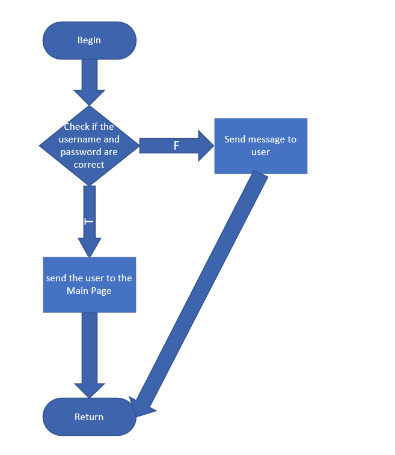
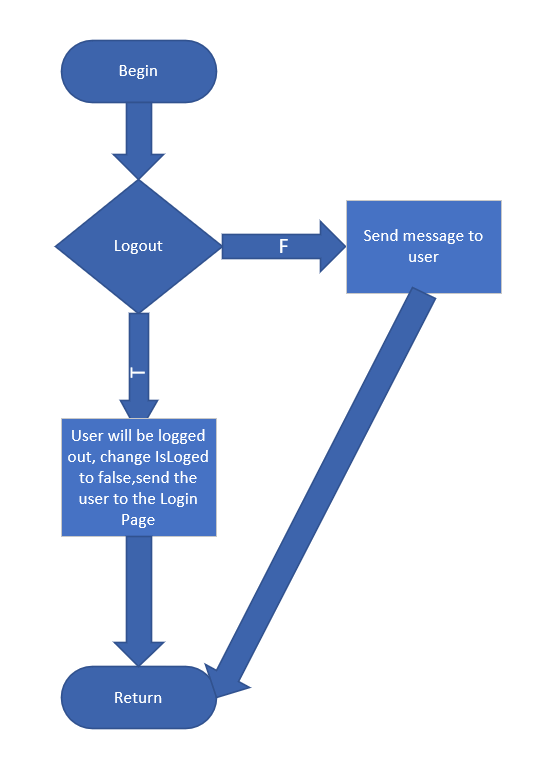

# Testing Plan

Revision History:

| Date   | Author | Description |
| ------ | ------ | ----------- |
| 5-18   | Meow   | Creat this document |
| 5-19   | Meow   | Add White Box Test Plan |
| 5-20   | Meow   | Add Black Box Test Plan |
| 5-20   | Meow   | Add Flow Diagram |

## Introduction

### Intended Audience and Purpose

This document provides the testing strategy and expected results, corresponding to the requirement from the customer. It consists of a general approach of our testing, and specific test cases for unit testing.

### How to use the document

This article is divided into two parts, white box testing and black box testing. We give test cases and expected results. You can check it in the corresponding section.

## Testing Strategy

White box testing uses basic path testing. We will give test cases for Javascript functions on the web side, intending to cover each path. Black-box testing uses the equivalence division method, and we will divide it into several valid equivalence classes and invalid equivalence classes to test the program's error handling capability. Pay particular attention to boundary values.

# Unit Test Cases (not finished)

## White Box Testing : logic test (Tamplate)

### In this part,we use basic path testing. We will give test cases for Javascript functions on the web side, intending to cover each path.

#### Test case 1 : Page: sign-in.html | Function Name: Login | Function Type: OnClick() Button: SignIn

### cases

| Input | Expected output | Test Results |
| ------ | ------ | ----------- |
| Correct Email and Password | lead  user to the Main Page |
| correct email wrong password | send message to user |
| wrong email and password | send message to user |

#### Test case 2 : Pages: dashboard.html, profile.html, users.html | Function Name: Logout | Function Type: OnClick() Button: Logout

### cases

| Input | Expected output | Test Results |
| ------ | ------ | ----------- |
| x | send user to the Login Page |

#### Test case 3 : Page: addUser.html Function Name: add_User Funtion Type: OnClick() Button: Add User

### cases

| Input | Expected output | Test Results |
| ------ | ------ | ----------- |
| have Admin permissions | Send message that the add occurred successfully |
| no Admin permissions | Send message to user that a error occurred |

#### Test case 4 : Page: editUser.html Function Name: edit_User Funtion Type: OnClick() Button: Edit User

### cases

| Input | Expected output | Test Results |
| ------ | ------ | ----------- |
| have Admin permissions | Send message that the edit occurred successfully |
| no Admin permissions | Send message to user that a error occurred |

#### Test case 5 : Page: addManager.html Function Name: add_Manager Funtion Type: OnClick() Button: Add Manager

### cases

| Input | Expected output | Test Results |
| ------ | ------ | ----------- |
| have Admin permissions | Send message that the edit occurred successfully |
| no Admin permissions | Send message to user that a error occurred |

#### Test case 6 : Page: Every Page Function Name: write_Logs

### cases

| Input | Expected output | Test Results |
| ------ | ------ | ----------- |
| database online | Write In the database the action performed in the web app |
| database offline | Send message that an error occurred |

#### Test case  : Page: Every Page Function Name: see_Logs Funtion Type: OnLoad() function

### cases

| Input | Expected output | Test Results |
| ------ | ------ | ----------- |

## Unfinished!!!I didn't find the js code and I don't know the internal logic. It will be improved in the future.

---------------------

## Black Box Test : equivalence division method
---------------------

#### Test case 1 : Page: sign-in.html | Function Name: Login | Function Type: OnClick() Button: SignIn

### cases 

| Input | valid equivalence class | invalid equivalence class |
| ------ | ------ | ----------- |
| Email | email format | invalid format,blank
| password | any | blank

### Test cases

### valid

| Input | Expected output | Test Results |
| ------ | ------ | ----------- |
| test3@test.com *** | login or failed |

### invalid

| Input | Expected output | Test Results |
| ------ | ------ | ----------- |
| jk32g *** | invalid Email  |
| (blank),*** | please input Email |
| test3@test.com,(blank) | please input password |

--------------------------------
### Test case 2 : Page:Page: addUser.html Function Name: add_User Funtion Type: OnClick() Button: Add User

### class

| Input | valid equivalence class | invalid equivalence class |
| ------ | ------ | ----------- |
| Name | no same name | have same name,blank
| Email | valid Email format | invalid Email format,have same Email,blank
| Password | any | blank
| Birthday | any | blank
| phone number | number | blank,has non-numeric characters

### Test Cases

### valid

| Input | Expected output | Test Results |
| ------ | ------ | ----------- |
| Mario,Mario.test.com,***,/03/08/2001,13344556678 | Success |

### invalid

| Input | Expected output | Test Results |
| ------ | ------ | ----------- |
|(blank),Mario.test.com,***,/03/08/2001,13344556678 | Name can not blank |
|Mario,Mario.test.com,***,/03/08/2001,13344556678 | have the same name |
|Mario,123123,***,/03/08/2001,13344556678 | Email Invalid |
|Mario,(blank),***,/03/08/2001,13344556678 | Please input your Email |
|Mario,Mario.test.com,***,/03/08/2001,13344556678 | have same Email |
|Mario,Mario.test.com,(blank),/03/08/2001,13344556678 | please input the password |
|Mario,Mario.test.com,***,(blank),13344556678 | please choose your birthday |
|Mario,Mario.test.com,***,/03/08/2001,(blank) | please input your phone number |
|Mario,Mario.test.com,***,/03/08/2001,133445ase | invalid phone number |

---------------------------------
### Test case 3 : Page: editUser.html Function Name: edit_User Funtion Type: OnClick() Button: Edit User

### class

| Input | valid equivalence class | invalid equivalence class |
| ------ | ------ | ----------- |
| Name | no same name | have same name,blank
| Email | valid Email format | invalid Email format,have same Email,blank
| Password | any | blank
| Birthday | any | blank
| phone number | number | blank,has non-numeric characters

### Test Cases

### valid

| Input | Expected output | Test Results |
| ------ | ------ | ----------- |
| Mario,Mario.test.com,***,/03/08/2001,13344556678 | Success |

### invalid

| Input | Expected output | Test Results |
| ------ | ------ | ----------- |
|(blank),Mario.test.com,***,/03/08/2001,13344556678 | Name can not blank |
|Mario,Mario.test.com,***,/03/08/2001,13344556678 | have the same name |
|Mario,123123,***,/03/08/2001,13344556678 | Email Invalid |
|Mario,(blank),***,/03/08/2001,13344556678 | Please input your Email |
|Mario,Mario.test.com,***,/03/08/2001,13344556678 | have same Email |
|Mario,Mario.test.com,(blank),/03/08/2001,13344556678 | please input the password |
|Mario,Mario.test.com,***,(blank),13344556678 | please choose your birthday |
|Mario,Mario.test.com,***,/03/08/2001,(blank) | please input your phone number |
|Mario,Mario.test.com,***,/03/08/2001,133445ase | invalid phone number |

---------------
### Test case 4 : Page: addManager.html Function Name: add_Manager Funtion Type: OnClick() Button: Add User

### class

| Input | valid equivalence class | invalid equivalence class |
| ------ | ------ | ----------- |
| Name | no same name | have same name,blank
| Email | valid Email format | invalid Email format,have same Email,blank
| Password | any | blank
| Birthday | any | blank

### Test Cases

### valid

| Input | Expected output | Test Results |
| ------ | ------ | ----------- |
| Mario,Mario.test.com,***,/03/08/2001 | Success |

### invalid

| Input | Expected output | Test Results |
| ------ | ------ | ----------- |
|(blank),Mario.test.com,***,/03/08/2001,13344556678 | Name can not blank |
|Mario,Mario.test.com,***,/03/08/2001,13344556678 | have the same name |
|Mario,123123,***,/03/08/2001,13344556678 | Email Invalid |
|Mario,(blank),***,/03/08/2001,13344556678 | Please input your Email |
|Mario,Mario.test.com,***,/03/08/2001,13344556678 | have same Email |
|Mario,Mario.test.com,(blank),/03/08/2001,13344556678 | please input the password |
|Mario,Mario.test.com,***,(blank),13344556678 | please choose your birthday |

---------------
### Test case 5 : 

### class

| Input | valid equivalence class | invalid equivalence class |
| ------ | ------ | ----------- |

### Test Cases

### valid

| Input | Expected output | Test Results |
| ------ | ------ | ----------- |

### invalid

| Input | Expected output | Test Results |
| ------ | ------ | ----------- |