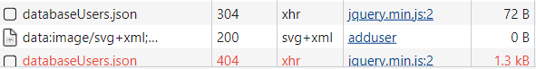

# Testing Plan

Revision History:

| Date   | Author | Description |
| ------ | ------ | ----------- |
| 5-18   | Meow   | Creat this document |
| 5-19   | Meow   | Add White Box Test Plan |
| 5-20   | Meow   | Add Black Box Test Plan |
| 5-20   | Meow   | Add Flow Diagram |
| 5-23   | Meow   | Update whithe box Test |
| 5-25   | Meow   | Update Black Box Test |
| 5-25   | Meow   | Write the 1.0 Test Report|
| 5-27   | Meow   | Write the 2.0 Test Reprot|

## Introduction

### Intended Audience and Purpose

This document provides the testing strategy and expected results, corresponding to the requirement from the customer. It consists of a general approach of our testing, and specific test cases for unit testing.

### How to use the document

This article is divided into two parts, white box testing and black box testing. We give test cases and expected results. You can check it in the corresponding section.

## Testing Strategy

White box testing uses basic path testing. We will give test cases for Javascript functions on the web side, intending to cover each path. Black-box testing uses the equivalence division method, and we will divide it into several valid equivalence classes and invalid equivalence classes to test the program's error handling capability. Pay particular attention to boundary values.

# Unit Test Cases 

## White Box Testing : logic test 

### In this part,we use basic path testing. We will give test cases for Javascript functions on the web side, intending to cover each path.

#### Test case 1 : Page: sign-in.html | Function Name: Login | Function Type: OnClick() Button: SignIn

### cases

| Behavior | Expected output | Test Results |
| ------ | ------ | ----------- |
| Page get the Database.json | x | Pass
| If Email and Passworld is correct | lead user to MainPage | Pass
| If Email and Passworld is incorrect | show error message | Pass

#### Test case 2 : Pages: dashboard.html, profile.html, users.html | Function Name: Logout | Function Type: OnClick() Button: Logout

### cases

| Behavior | Expected output | Test Results |
| ------ | ------ | ----------- |
| Click Logout Button | send user to the Login Page |Pass

#### Test case 3 : Page: addUser.html Function Name: add_User Funtion Type: OnClick() Button: Add User

### cases

| Behavior | Expected output | Test Results |
| ------ | ------ | ----------- |
| Get values from User | x | Pass
| Get Original jason from server | x | Pass
| Add new User information to json | x | Pass
| Send new json to Server | x | Failed
| Send a Message to User | Show "Thanks" | Pass

#### Test case 4 : Page: editUser.html Function Name: edit_User Funtion Type: OnClick() Button: Edit User

### cases

| Behavior | Expected output | Test Results |
| ------ | ------ | ----------- |
| have Admin permissions | Send message that the edit occurred successfully |unimplemented
| no Admin permissions | Send message to user that a error occurred |unimplemented

#### Test case 5 : Page: addManager.html Function Name: add_Manager Funtion Type: OnClick() Button: Add Manager

### cases

| Behavior | Expected output | Test Results |
| ------ | ------ | ----------- |
| Get values from User | x | Pass
| Get Original jason from server | x | Pass
| Add new User information to json | x | Pass
| Send new json to Server | x | Failed
| Send a Message to User | Show "Thanks" | Pass

#### Test case 6 : Page: Every Page Function Name: write_Logs

### cases
Expected
| Behavior | Expected output | Test Results |
| ------ | ------ | ----------- |
| database online | Write In the database the action performed in the web app |unimplemented
| database offline | Send message that an error occurred |unimplemented

#### Test case 7 : Page: Every Page Function Name: see_Logs Funtion Type: OnLoad() function

### cases

| Behavior | Expected output | Test Results |
| ------ | ------ | ----------- |
| Get json of logs from server | x | Pass
| show the log | show the log on screen |Pass

#### Test case 8 : Page: : users.html, logs.html, manager.html Function Name Filter_By_Name Funtion Type: OnChange() function (Search bar)

### cases

| Behavior | Expected output | Test Results |
| ------ | ------ | ----------- |
| Search bar changed | Filter the matching options and display | Pass

#### Test case 9 : Page:showlog.html Function Name:showlog

| Behavior | Expected output | Test Results |
| ------ | ------ | ----------- |
| Get json of logs from server | x | Pass
| show the log | show the log on screen |Pass

---------------------
---------------------

## Black Box Test : equivalence division method
---------------------

#### Test case 1 : Page: sign-in.html | Function Name: Login | Function Type: OnClick() Button: SignIn

### cases 

| Input | valid equivalence class | invalid equivalence class |
| ------ | ------ | ----------- |
| Email | email format | invalid format,blank
| password | any | blank

### Test cases

### valid

| Input | Expected output | Test Results |
| ------ | ------ | ----------- |
| test3@test.com *** | login or failed |Pass

### invalid

| Input | Expected output | Test Results |
| ------ | ------ | ----------- |
| jk32g *** | invalid Email  |Pass
| (blank),*** | please input Email |Pass
| test3@test.com,(blank) | please input password |Pass

--------------------------------
### Test case 2 : Page:Page: addUser.html Function Name: add_User Funtion Type: OnClick() Button: Add User

### class

| Input | valid equivalence class | invalid equivalence class |
| ------ | ------ | ----------- |
| Name | any | blank
| Email | valid Email format | invalid Email format,have same Email,blank
| Password | any | blank
| Birthday | any | blank
| phone number | number | blank,has non-numeric characters

### Test Cases

### valid

| Input | Expected output | Test Results |
| ------ | ------ | ----------- |
| test1,test1.test.com,***,/03/08/2001,13344556678 | Success |Pass

### invalid

| Input | Expected output | Test Results |
| ------ | ------ | ----------- |
|(blank),test1.test.com,***,/03/08/2001,13344556678 | Name can not blank |Failed
|test1,123123,***,/03/08/2001,13344556678 | Email Invalid |Failed
|test1,(blank),***,/03/08/2001,13344556678 | Please input your Email |Failed
|test1,test1.test.com,***,/03/08/2001,13344556678 | have same Email |Failed
|test1,test1.test.com,(blank),/03/08/2001,13344556678 | please input the password |Failed
|test1,test1.test.com,***,(blank),13344556678 | please choose your birthday |Failed
|test1,test1.test.com,***,/03/08/2001,(blank) | please input your phone number |Failed
|test1,test1.test.com,***,/03/08/2001,133445ase | invalid phone number |Failed

---------------------------------
### Test case 3 : Page: editUser.html Function Name: edit_User Funtion Type: OnClick() Button: Edit User

### class

| Input | valid equivalence class | invalid equivalence class |
| ------ | ------ | ----------- |
| Name | any | blank
| Email | valid Email format | invalid Email format,have same Email,blank
| Password | any | blank
| Birthday | any | blank
| phone number | number | blank,has non-numeric characters

### Test Cases

### valid

| Input | Expected output | Test Results |
| ------ | ------ | ----------- |
| test1,test1.test.com,***,/03/08/2001,13344556678 | Success |unimplemented

### invalid

| Input | Expected output | Test Results |
| ------ | ------ | ----------- |
|(blank),test1.test.com,***,/03/08/2001,13344556678 | Name can not blank |unimplemented
|test1,123123,***,/03/08/2001,13344556678 | Email Invalid |unimplemented
|test1,(blank),***,/03/08/2001,13344556678 | Please input your Email |unimplemented
|test1,test1.test.com,***,/03/08/2001,13344556678 | have same Email |unimplemented
|test1,test1.test.com,(blank),/03/08/2001,13344556678 | please input the password |unimplemented
|test1,test1.test.com,***,(blank),13344556678 | please choose your birthday |unimplemented
|test1,test1.test.com,***,/03/08/2001,(blank) | please input your phone number |unimplemented
|test1,test1.test.com,***,/03/08/2001,133445ase | invalid phone number |unimplemented

---------------
### Test case 4 : Page: addManager.html Function Name: add_Manager Funtion Type: OnClick() Button: Add User

### class

| Input | valid equivalence class | invalid equivalence class |
| ------ | ------ | ----------- |
| Name | any | blank
| Email | valid Email format | invalid Email format,have same Email,blank
| Password | any | blank
| Birthday | any | blank

### Test Cases

### valid

| Input | Expected output | Test Results |
| ------ | ------ | ----------- |
| test1,test1.test.com,***,/03/08/2001 | Success |Pass

### invalid

| Input | Expected output | Test Results |
| ------ | ------ | ----------- |
|(blank),test1.test.com,***,/03/08/2001,13344556678 | Name can not blank |Failed
|test1,123123,***,/03/08/2001,13344556678 | Email Invalid |Failed
|test1,(blank),***,/03/08/2001,13344556678 | Please input your Email |Failed
|test1,test1.test.com,***,/03/08/2001,13344556678 | have same Email |Failed
|test1,test1.test.com,(blank),/03/08/2001,13344556678 | please input the password |Failed
|test1,test1.test.com,***,(blank),13344556678 | please choose your birthday |Failed

---------------
### Test case 5 : Page: : users.html, logs.html, manager.html Function Name Filter_By_Name Funtion Type: OnChange() function (Search bar)

### class

| Input | valid equivalence class | invalid equivalence class |
| ------ | ------ | ----------- |
|   -    | existent data | non-existent data

### Test Cases

### valid

| Input | Expected output | Test Results |
| ------ | ------ | ----------- |
| add    | all cards include "add" |Pass
| tomas  | all cards include "tomas" | Pass
| 2017   | all cards include "2017" | Pass

### invalid

| Input | Expected output | Test Results |
| ------ | ------ | ----------- |
| addd   | none | Pass
| tomsa  | none | Pass
| 2018 | none | Pass

